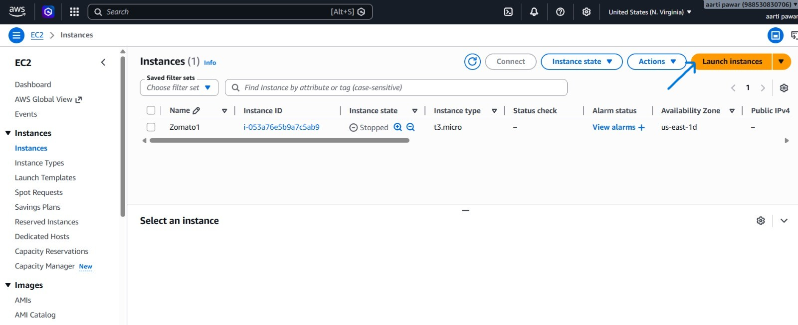
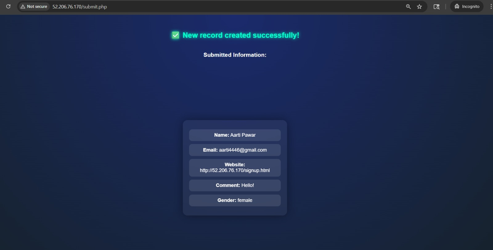

# 🎓 Student Registration Form – Dynamic Website on AWS EC2

## 💡 About This Project

In this project, I created a **Student Registration Form** as a dynamic website where user details are stored in a MySQL database.

Earlier, I had only worked on static websites where data was not stored anywhere. So I wanted to understand how real applications work when a user submits a form.

In this project, when a user enters their details (name, email, password), the data is sent to a PHP file and then stored in the database. This helped me understand the complete flow from frontend to backend and database.

I also used CSS to design the form so that it looks clean and user-friendly instead of a plain basic form.

### 📌 What I wanted to learn 

- How form data is handled  
- How PHP connects with MySQL  
- How data is stored in database  
- How to deploy a dynamic website on AWS EC2  

✨ This is a beginner-level project, but it gave me a clear idea of how real websites manage user data.

---

## 🧩 What I Built

- Signup form using HTML + CSS  
- PHP file (submit.php) to handle form submission  
- MySQL database to store student data  
- Hosted on AWS EC2 (Ubuntu)  

Everything connected → frontend → backend → database  

---

## 🧰 Tools & Technologies

- HTML & CSS → form design  
- PHP → backend logic  
- MySQL → database  
- Apache → web server  
- AWS EC2 (Ubuntu) → deployment  

---

## Architecture Overview
  <p align="center">
  
</p>
---

## 🛠️ Tech Stack
- Frontend: HTML, CSS, JavaScript
- Web Server: Nginx
- Cloud Platform: AWS EC2 (Amazon Linux)
- Scripting: Bash

---

## ⚙️ Deployment Steps

### 1. Launch EC2 Instance
- AMI: Ubuntu
- Instance Type: t2.micro (Free Tier)
- Security Group: launch-wizard-1
  - SSH (22) → My IP
  - HTTP (80) → Anywhere


<p align="center">
  
</p>

---
<p align="center">
  
</p>

---
<p align="center">
  
</p>

---
<p align="center">
  
</p>

---
<p align="center">
  
</p>

---
<p align="center">
  
</p>

---
<p align="center">
  
</p>

---

### 2. EC2 Login using SSH
<p align="center">
  
</p>

---
<p align="center">
  
</p>

---
<p align="center">
  
</p>

---
<p align="center">
  
</p>

---

### 3. Change Hostname

```bash
sudo hostnamectl hostname Student-Registration
```
---
### LAMP Stack Installation and Configuration
```bash
sudo apt update
sudo apt install apache2 mysql-server php php-fpm -y
sudo systemctl start apache2 mysql php8.3-fpm
sudo systemctl enable apache2 mysql php8.3-fpm
```
---
## 4. Creating Project Files and Database Setup

After installing all required software, I moved to the web server directory:

cd /var/www/html

Then I created my project files using vim editor:
```bash
sudo vim signup.html
sudo vim submit.php
```
In signup.html, I created the form and added CSS inside the head section.

In submit.php, I wrote backend code to connect with MySQL and insert user data.

After that, I opened MySQL and set password for the database:

```bash
sudo mysql
alter user root@localhost identified by 'root';
exit
sudo mysql -u root -p
password=root
```
Then I configured database connection details like:
username, password, host (localhost) inside submit.php.

Next, I created a database and table to store user data.

```bash
create databse FCT;
use FCT
CREATE TABLE users (
    id INT PRIMARY KEY AUTO_INCREMENT,
    name VARCHAR(20),
    email VARCHAR(100),
    website VARCHAR(255),
    gender VARCHAR(6),
    comment VARCHAR(100)
);
desc users;
```
<p align="center">
  
</p>

---
## ⚠️ Issue I Faced

While working on this project, I got confused during MySQL connector installation.

When I was trying on **Amazon Linux**, I used this command:

```bash
sudo yum install php8.5-mysqlnd.x86_64
```

Later, when I was doing the same setup on **Ubuntu with Apache**, I tried using the same command, but it did not work.

Then I understood that the command is different for Ubuntu, and I used:

```bash
sudo apt install php-mysql
```

At that time, I got confused between both commands, but after using the correct one, the database connection worked properly.

---
### 5. Access The Application
1. Go to AWS EC2 Dashboard  
2. Select your running instance  
3. Copy the Public IP address 

<p align="center">
  
</p>

---
4. Open a new Incognito window in your browser  

5. Paste the IP address in the URL like this:  
   http://<public-ip>/signup.html  

6. Press Enter to view the website  

<p align="center">
  
</p>
<p align="center">
  
</p>

---
## 📖 Key Takeaways

- Learned how to create and connect an EC2 instance using SSH  
- Got familiar with basic Linux commands while working on the server  
- Understood how Nginx serves static files like HTML and CSS  
- Practiced creating and editing files using vim editor  
- Used a Bash script to download multiple images in one go  
- Understood how a website is accessed using public IP  

---

## 📈 What Changed After This Project

**Before:**

- Only static websites  

**After:**

- Understand how data is stored in database  
- Know how PHP connects with MySQL  
- Can deploy dynamic project on cloud  

---

## 🌱 What I Want to Do Next

- Add login system  
- Improve UI design  
- Add validation  
- Store password securely  
- Try domain + HTTPS  

---

## 📝 Final Thoughts

This is my first dynamic project where I worked with backend and database.

It is simple, but it helped me understand how real websites handle user data.

🚀 Good step forward for me in web development


