# 🎵 Spotify Clone – Static Website Deployment on AWS EC2

## 📌 Project Overview
In this project,P I have created a Spotify-inspired static website and deployed it on an AWS EC2 instance using Amazon Linux and Nginx.

The main aim was to understand how a website can be hosted on a cloud server. I created the HTML, CSS, and JavaScript files directly inside the EC2 instance. For images, I used a Bash script where all images were downloaded at once using wget, which made the process faster and easier.

This project helped me understand basic cloud concepts, Linux commands, and how Nginx works as a web server.

---

## 🚀 Features
- Spotify-like UI design
- Static website hosting on AWS
- Nginx web server setup
- Image download using Bash script
- Simple and clean layout

---
 
## Architecture Overview
  <p align="center">
  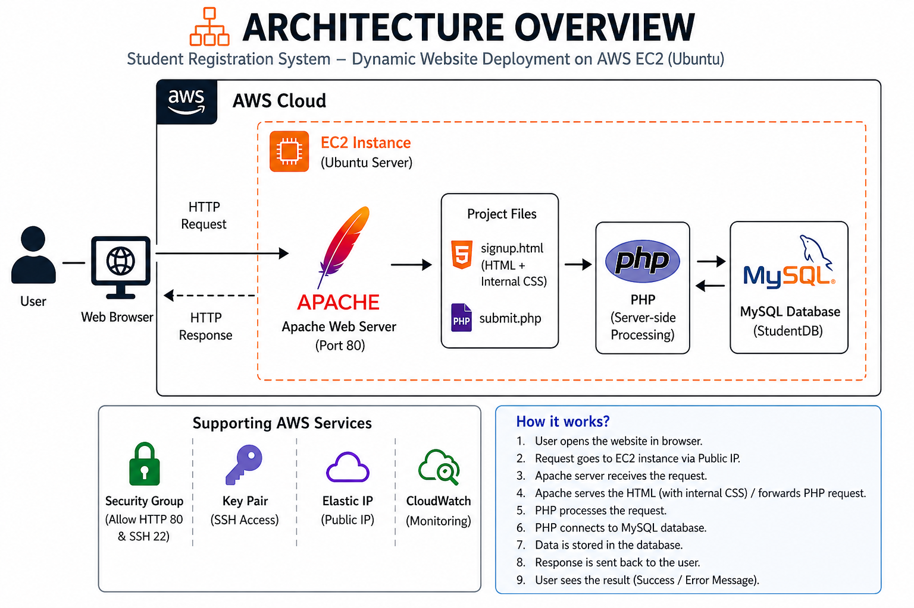
</p>
---

## 🛠️ Tech Stack
- Frontend: HTML, CSS, JavaScript
- Web Server: Nginx
- Cloud Platform: AWS EC2 (Amazon Linux)
- Scripting: Bash

---

## ⚙️ Deployment Steps

### 1. Launch EC2 Instance
- AMI: Amazon Linux
- Instance Type: t2.micro (Free Tier)
- Security Group: launch-wizard-1
  - SSH (22) → My IP
  - HTTP (80) → Anywhere


<p align="center">
  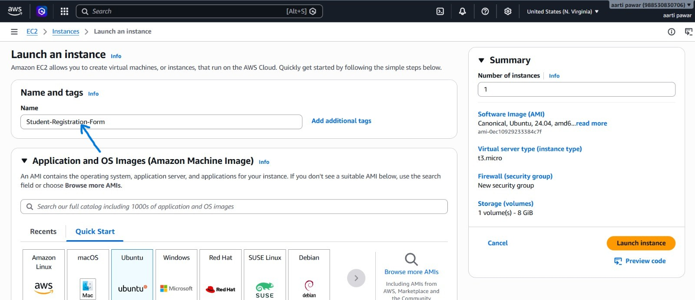
</p>

---
<p align="center">
  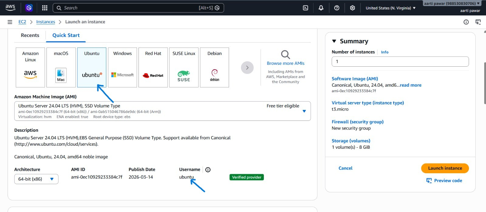
</p>

---
<p align="center">
  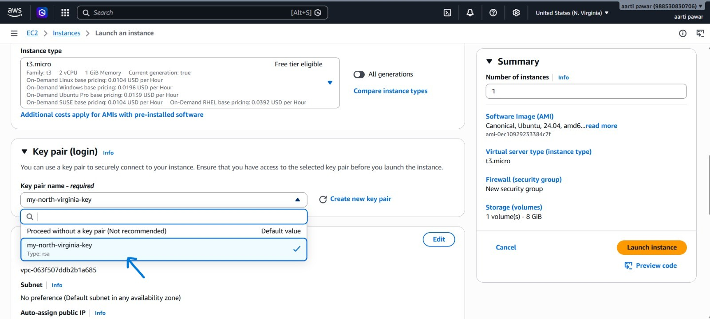
</p>

---
<p align="center">
  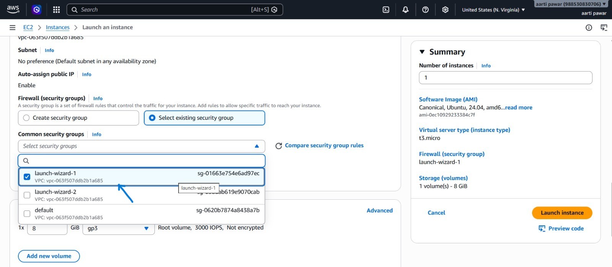
</p>

---
<p align="center">
  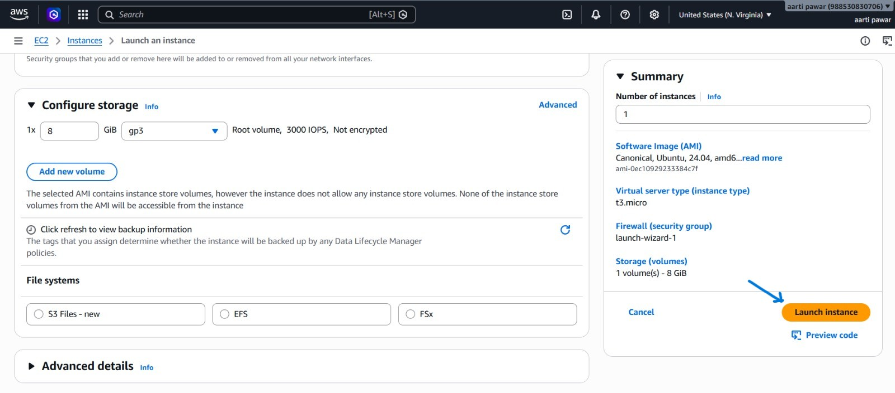
</p>

---
<p align="center">
  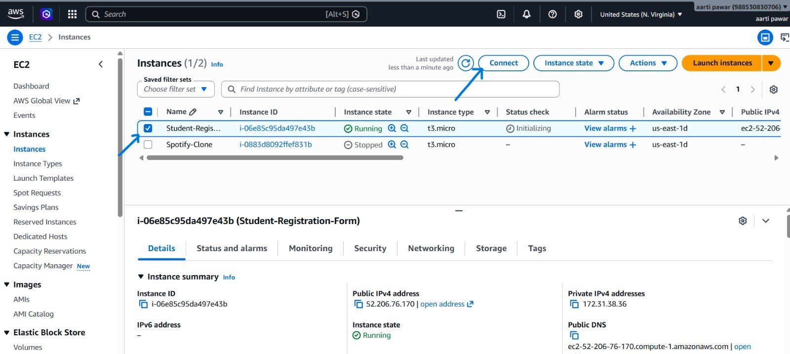
</p>

---

### 2. EC2 Login using SSH
<p align="center">
  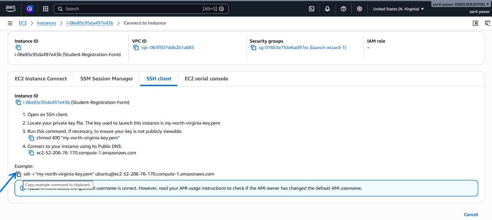
</p>

---
<p align="center">
  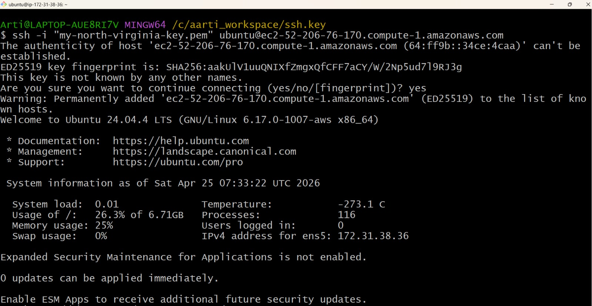
</p>

---
<p align="center">
  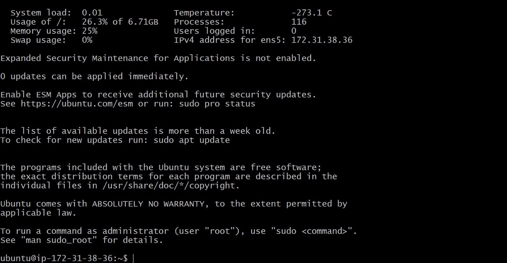
</p>

---

### 3. Change Hostname

```bash
sudo hostnamectl hostname Spotify
```
---
### Install Nginx
```bash
sudo yum update
sudo yum install nginx -y
sudo systemctl start nginx
sudo systemctl enable nginx
sudo systemctl status nginx
```
<p align="center">
  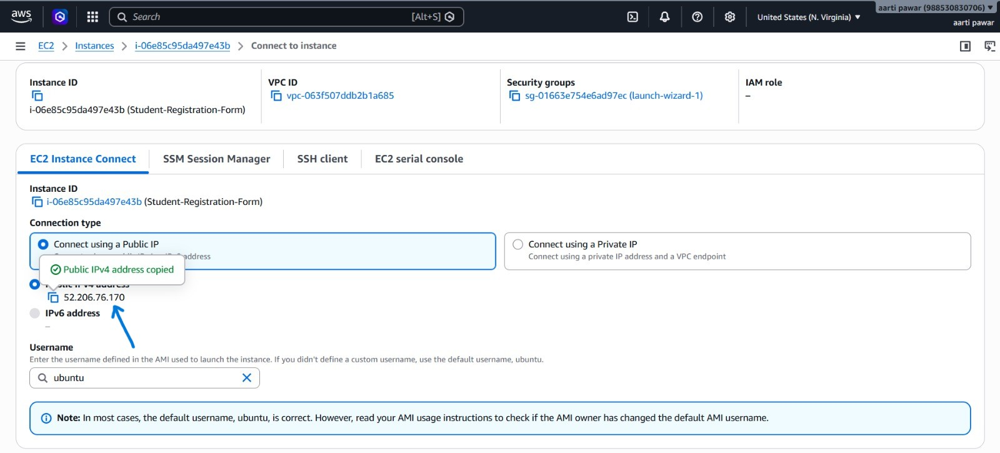
</p>

---

### 4. Delete Nginx Default File and Create New Files
```bash
sudo rm -rf index.html
```
---
## 💻 File Creation Process

Inside the EC2 instance, I navigated to the default Nginx directory `/usr/share/nginx/html/`.

In this location, I created the required project files such as index.html, style.css, and script.js using the vim editor.

I added the respective HTML, CSS, and JavaScript code inside these files to build the Spotify-inspired user interface.

For images, I created a Bash script and used wget commands to download all images at once.

This approach helped me directly manage and deploy the project on the server without using file transfer methods.

```bash
cd /usr/share/nginx/html
```

```bash
sudo vim index.html
```

```bash
sudo vim style.css
```

```bash
sudo vim script.js
```
```bash
sudo vim download-images.sh
```
```bash
sudo bash download-images.sh
```
```bash
sudo systemctl restart nginx
```
### 5. Access The Application
1. Go to AWS EC2 Dashboard  
2. Select your running instance  
3. Copy the Public IP address 

<p align="center">
  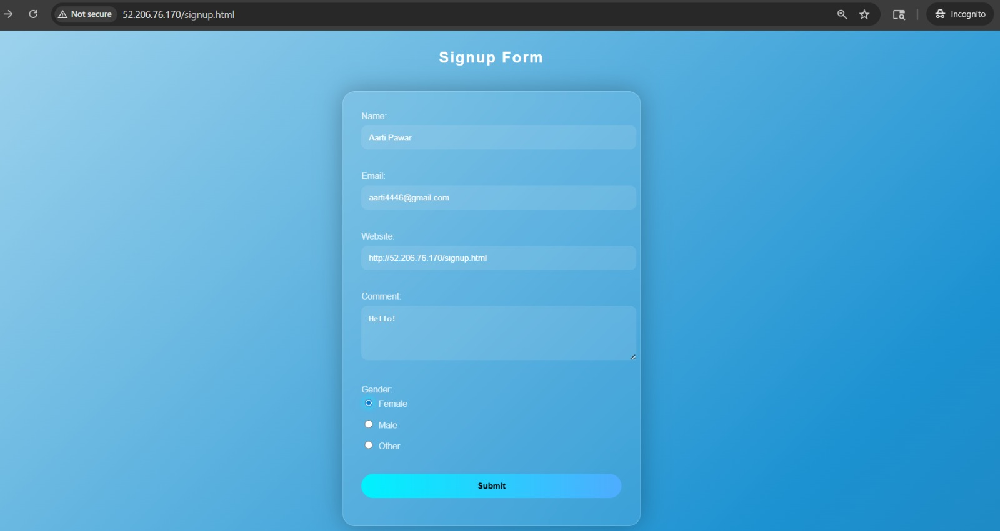
</p>

---
4. Open a new Incognito window in your browser  

5. Paste the IP address in the URL like this:  
   http://<public-ip>/index.html  

6. Press Enter to view the website  

<p align="center">
  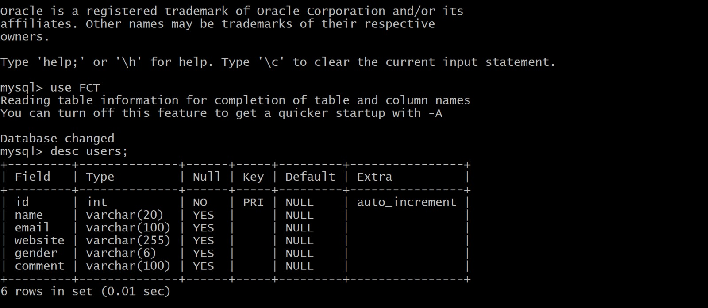
</p>

---
## 📖 Key Takeaways

- Learned how to create and connect an EC2 instance using SSH  
- Got familiar with basic Linux commands while working on the server  
- Understood how Nginx serves static files like HTML and CSS  
- Practiced creating and editing files using vim editor  
- Used a Bash script to download multiple images in one go  
- Understood how a website is accessed using public IP  

---

## 🚀 Next Steps

- Improve the UI to make it more responsive  
- Add more features using JavaScript  
- Connect a custom domain instead of using IP address  
- Enable HTTPS for better security  
- Explore container-based deployment like Docker  

---

## 📝 Final Thoughts

This project gave me practical experience of deploying a static website on AWS EC2. I got to work with Nginx, Linux environment, and basic scripting. It helped me understand how real websites are hosted and managed on a server.


